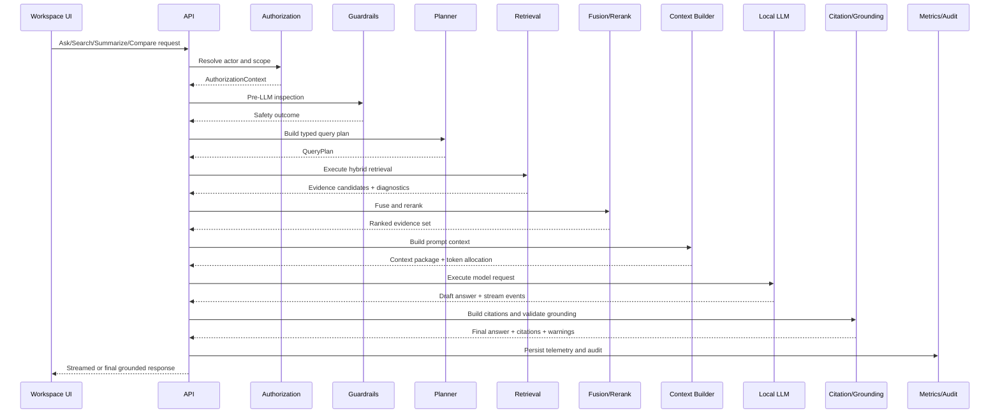
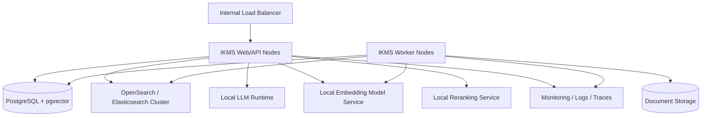

# Phase 5A: Customer-Centric Enterprise RAG Blueprint

## Executive Summary

This document is the Phase 5A implementation blueprint for a production-grade, customer-centric Enterprise RAG and Knowledge Retrieval Platform for IKMS.

The design preserves the mandatory product boundary:

- Customer is the primary business context.
- IKMS manages knowledge, documents, search, review, evidence, and AI assistance.
- Policy Number, Claim Number, Insurer, Effective Date, Expiry Date, Renewal Date, Broker Reference, and similar insurance attributes are Business Reference Fields.
- Business Reference Fields are searchable, filterable, and indexable.
- Policy and Claim are not IKMS entities, repositories, services, aggregate roots, or workspaces.
- The broker platform remains the system of record.

The target architecture keeps the existing frontend stable while introducing a backend retrieval platform that is:

- permission-aware
- grounded
- explainable
- locally deployable
- observable
- scalable inside an on-prem enterprise environment

## Current Implementation Status

Phase 5A describes the approved target architecture.

As of July 15, 2026, the implemented retrieval platform uses PostgreSQL and pgvector-backed retrieval projections.

OpenSearch / Elasticsearch remains a planned future lexical and structured retrieval engine and is not yet active.

## Implementation Status as of July 15, 2026

| Capability | Current Status | Active Implementation | Future Direction |
| --- | --- | --- | --- |
| Canonical Knowledge Storage | Active | Customer knowledge artifacts | Unchanged |
| Retrieval Projection | Active | PostgreSQL `embedding_chunk` | Continue |
| Vector Retrieval | Active | PostgreSQL `pgvector` | Evaluate coexistence |
| Keyword Retrieval | Active | PostgreSQL retrievers | OpenSearch candidate |
| Structured Filtering | Active | PostgreSQL | OpenSearch candidate |
| Business Reference Search | Active | PostgreSQL indexed fields | Continue |
| OpenSearch | Planned | Not active | Future lexical engine |
| Reindexing | Active | Projection rebuild | Extend |
| Consistency | Active | Eventual | Preserve |

Current implementation notes:

- `embedding_chunk` is the live retrieval projection for chunk text, embeddings, source lineage, customer scope, Business Reference Fields, document version, content hash, and `reindex_version`.
- Query-time vector retrieval generates embeddings through the configured embedding provider and executes nearest-neighbour search against persisted chunk vectors.
- When embeddings or vector retrieval are unavailable, the system degrades to keyword, Business Reference Field, and structured-filter retrieval with visible diagnostics or warnings.
- The canonical source of truth remains documents, document versions, emails, notes, OCR text, extracted fields, reviewed values, customer associations, and Business Reference Fields.
- The retrieval projection is rebuildable and should not be treated as the system of record.

## Current vs Target vs Future

- Current implementation:
  PostgreSQL `embedding_chunk` is the active retrieval projection and `pgvector` is the active vector retrieval path.
- Approved target architecture:
  Hybrid enterprise retrieval architecture with clear separation of planning, retrieval, fusion, context building, and grounding remains the approved design.
- Future roadmap:
  OpenSearch / Elasticsearch may be introduced as a future lexical and structured retrieval engine after implementation, migration, synchronization, benchmarking, and operational validation.

## Architecture Overview

The recommended solution remains a modular Spring Boot monolith for Phase 5B, with clear internal service boundaries and isolated infrastructure adapters.

Major layers:

1. API Layer
2. Authorization and Guardrail Layer
3. AI Orchestration Layer
4. Hybrid Retrieval Layer
5. Context and Citation Layer
6. Local Model Runtime Adapters
7. Search and Indexing Layer
8. Audit, Evaluation, and Observability Layer

## Component Diagram


## Service Responsibilities

### API Layer

Responsibilities:

- expose existing and minimally extended AI/search endpoints
- validate request shape
- bind workspace context such as customer, document, review item, and conversation
- return streaming and non-streaming responses

Required operations:

- `Ask`
- `Search`
- `Summarize`
- `Explain`
- `Compare`
- `Extract`
- `Validate`
- `Evidence Expansion`
- `Conversation Continuation`

### Authorization and Scope Resolver

Responsibilities:

- authenticate actor identity
- resolve customer/document/review access before retrieval
- enforce original vs redacted access
- prevent restricted documents from entering prompt context
- return a normalized authorization context to downstream services

Design rule:

Authorization must complete before search retrieval, vector retrieval, or prompt assembly.

### Guardrail Layer

Responsibilities:

- prompt injection detection
- restricted content detection
- PII masking and permission trimming
- safe-failure decisions
- grounding sufficiency validation
- audit event enrichment

Design rule:

Guardrails run both before LLM execution and after response generation.

### Intent Detector and Business Reference Extractor

Responsibilities:

- classify intent using deterministic rules first
- extract customer-centric retrieval hints
- identify business reference fields without turning them into entity lookups

Supported outputs:

- intent
- query scope
- source preferences
- document type preferences
- structured Business Reference Fields
- answer mode

### Typed Query Planner

Responsibilities:

- produce a provider-independent query plan
- choose retrieval modes
- decide evidence granularity
- allocate token budget envelope
- determine version preference
- attach conversation-memory strategy

### Hybrid Retrieval Coordinator

Responsibilities:

- run lexical, vector, and structured retrieval in parallel
- enforce authorization-aware filtering within each retriever
- collect retrieval diagnostics
- preserve source lineage for every candidate

### Fusion and Reranking

Responsibilities:

- merge heterogeneous retrieval candidates
- remove duplicates
- preserve source diversity
- prefer current versions where appropriate
- balance freshness, relevance, and evidence quality

### Context Builder

Responsibilities:

- assemble system instructions
- order evidence
- stitch adjacent chunks when useful
- include customer context and conversation memory
- enforce token budgets
- exclude unnecessary or weak evidence

### Citation and Grounding Layer

Responsibilities:

- assign stable citation identifiers
- map evidence lineage to response citations
- validate source coverage
- attach warnings and restricted-content notices

### Audit, Evaluation, and Observability

Responsibilities:

- record orchestration traces
- record model and retrieval metrics
- store feedback and evaluation signals
- expose latency, safety, and grounding metrics

## End-To-End Sequence



## AI Orchestration Design

### Supported Service Operations

`Ask`

- answer a user question from authorized customer knowledge

`Search`

- return ranked knowledge results and evidence summaries without forcing answer generation

`Summarize`

- summarize a customer, document, or customer-scoped result set

`Explain`

- explain why a document, review item, or answer requires attention

`Compare`

- compare documents, versions, or correspondence sets

`Extract`

- extract structured fields from authorized customer knowledge

`Validate`

- validate extracted fields against retrieved evidence

### Orchestration Boundaries

The orchestration service owns:

- execution policy selection for retrieval and model execution
- error handling, timeout, retry, and fallback
- streaming coordination
- guardrail enforcement integration
- response assembly

The orchestration service does not own:

- direct storage access logic
- search-engine-specific query construction
- OCR execution
- document lifecycle operations

## Hybrid Search Architecture

### Retrieval Modes

1. Lexical search
2. Vector search
3. Structured field search
4. Business Reference Field search
5. Customer-context search
6. Version-aware retrieval

### Retrieval Scope Model

Supported scopes:

- global authorized customer knowledge
- one customer
- one review item
- one document
- one document version
- one conversation

Policy Number and Claim Number may constrain retrieval, but only as indexed Business Reference Fields attached to customer knowledge.

### Ranking Strategy

Recommended sequence:

1. execute lexical, vector, and structured retrieval in parallel
2. normalize candidate scores
3. combine using Reciprocal Rank Fusion
4. deduplicate by evidence lineage
5. apply reranking using:
   - customer scope match
   - source type relevance
   - version preference
   - freshness
   - OCR/extraction confidence
   - restricted-content penalties
   - citation quality potential
6. enforce source diversity caps

### Reranking Model

Preferred design:

- local cross-encoder reranker behind an abstraction
- deterministic fallback when reranker is unavailable

## Search Index Design

Recommended search model: document-version-centric chunks with first-class customer and Business Reference Field projections.

### Primary Indexed Fields

| Field | Purpose |
| --- | --- |
| `customerId` | primary business scope and permission anchor |
| `documentId` | document lineage and evidence source reference |
| `documentVersionId` | version-aware retrieval and citation precision |
| `documentType` | filtering, ranking, and summarization behavior |
| `sourceType` | distinguish document, email, note, review, OCR, metadata, or conversation evidence |
| `title` | lexical search relevance and result display |
| `chunkText` | chunk-level lexical retrieval and grounding |
| `ocrText` | OCR-derived retrieval when chunk normalization differs from raw OCR |
| `embedding` | semantic vector retrieval |
| `pageNumber` | page-level citation and viewer navigation |
| `sectionLabel` | section-level evidence explanation |
| `chunkIndex` | chunk lineage and deterministic stitching |
| `versionNumber` | version sorting and comparison |
| `isCurrentVersion` | current-version preference |
| `receivedDate` | communication and document recency reasoning |
| `createdDate` | temporal filtering and freshness |
| `securityClassification` | restricted-content routing |
| `acl` | authorization filtering |
| `contentHash` | duplicate control and lineage |
| `sourceSystem` | external provenance |

### Business Reference Fields

| Field | Purpose |
| --- | --- |
| `policyNumber` | searchable/filterable customer knowledge attribute |
| `claimNumber` | searchable/filterable customer knowledge attribute |
| `insurer` | routing, filtering, summarization, and answer explanation |
| `policyType` | product-context retrieval refinement |
| `effectiveDate` | structured temporal policy-reference filtering |
| `expiryDate` | structured temporal policy-reference filtering |
| `renewalDate` | renewal-centric retrieval and alerts |
| `brokerReference` | external reconciliation and search |
| `externalReference` | source-system lookup without entity ownership |

Design rule:

These remain first-class indexed fields, not opaque JSON metadata blobs.

### Storage Split

- Current implementation:
  PostgreSQL plus pgvector is the active retrieval storage and vector search platform.
- Target future split:
  OpenSearch or Elasticsearch may become the primary lexical and structured retrieval index in a future phase.
- PostgreSQL remains the canonical chunk projection, embedding store, lineage store, and audit-linked retrieval trace anchor in the current implementation.

## Query Planner Design

### Planner Inputs

- user question
- operation type
- workspace context
- customer scope
- authorized source scope
- conversation history summary
- UI filters

### Planner Outputs

```text
QueryPlan
  - intent
  - queryScope
  - customerScope
  - queryText
  - sourceTypes[]
  - documentTypes[]
  - dateRange
  - businessReferenceFields
  - resultLimit
  - sortOrder
  - versionPreference
  - evidenceGranularity
  - tokenBudget
  - memoryStrategy
```

### Intent Detection

Use deterministic routing first:

- verb and phrase patterns
- workspace origin
- explicit compare/extract/validate hints
- presence of dates, version terms, or business references

Optional future extension:

- local classifier model behind the same interface

### Business Reference Extraction

Extraction should support:

- exact policy number and claim number patterns
- insurer normalization
- date normalization
- explicit UI filters
- user phrasing such as "for policy", "related to claim", "latest renewal", "from insurer"

### Token Budgeting

Budget order:

1. system instructions
2. user request
3. critical workspace context
4. top-ranked evidence
5. business reference summary
6. conversation memory
7. optional low-priority evidence

## Context Builder Design

### Context Ordering

Recommended order:

1. system policy and safety instructions
2. answer contract and grounding rules
3. customer context summary
4. business reference summary
5. current workspace context
6. conversation memory summary
7. ranked evidence blocks
8. explicit response constraints

### Evidence Prioritization

Prefer:

- direct evidence from current customer scope
- current document version when not comparing versions
- high-confidence extracted fields when backed by source text
- recent correspondence when the question implies recency
- multiple source types when cross-checking improves grounding

Avoid:

- duplicate chunks
- low-confidence OCR without corroboration
- restricted or permission-trimmed evidence
- stale versions unless explicitly requested

### Deduplication and Chunk Stitching

Deduplication keys:

- documentVersionId + pageNumber + chunkIndex
- contentHash for exact duplicates

Chunk stitching rule:

- merge adjacent chunks only when they share source lineage and improve coherence without exceeding token budget

## Citation Design

### Citation Model

Each citation should support:

- `citationId`
- `sourceType`
- `customerId`
- `documentId`
- `documentVersionId`
- `pageNumber`
- `sectionLabel`
- `chunkIndex`
- `confidence`
- `supportingAttributes`
- `futureJumpTargetId`

### Evidence Lineage

Citation lineage must preserve:

- original source object
- version lineage
- page or chunk origin
- retrieval mode contribution
- whether evidence was trimmed, masked, or partially hidden

### Citation Rules

- citations refer to knowledge sources, not to policy or claim pseudo-entities
- Business Reference Fields appear as supporting attributes inside citations
- future OCR region references must fit into the same lineage model

Example:

```text
Document: Renewal Notice.pdf
Version: 3
Page: 4
Supporting attributes:
  Policy Number: POL-12345
  Claim Number: CLM-9988
```

## Guardrail Design

### Pre-Retrieval Controls

- actor authentication
- permission scope resolution
- source-type restrictions
- original vs redacted access checks

### Pre-LLM Controls

- prompt injection detection on retrieved evidence
- PII masking based on permission profile
- restricted-document exclusion
- token budget enforcement

### Post-LLM Controls

- citation coverage validation
- grounding sufficiency validation
- hallucination-safe failure
- warning generation
- restricted-content notice propagation

### Safe Failure Modes

Return structured outcomes for:

- insufficient evidence
- prohibited request
- restricted content excluded
- timeout with no grounded answer
- streaming interruption

Required answer behavior:

If the system cannot ground an answer, it must return:

`Insufficient evidence to answer.`

## Evaluation Framework

### Core Metrics

- retrieval precision
- retrieval recall
- citation coverage
- citation accuracy
- grounding score
- latency
- token usage
- business reference extraction accuracy
- business reference search accuracy
- permission leakage rate
- restricted-content exclusion rate
- hallucination rate
- streaming continuity

### Evaluation Dataset Types

- customer summary fixtures
- policy-number retrieval fixtures
- claim-number correspondence fixtures
- version-comparison fixtures
- restricted-document leakage fixtures
- PII trimming fixtures
- insurer-focused retrieval fixtures
- review-explanation fixtures

### Regression Strategy

- deterministic fixture suite in CI
- benchmark suite for seeded enterprise scenarios
- release gate on permission leakage and citation coverage

## Conversation Memory Design

### Memory Types

- request-local memory
- conversation memory
- workspace memory
- customer-summary memory

### Lifecycle

- create memory on first conversation request
- summarize older turns when token budget pressure appears
- preserve citation lineage for prior turns
- expire inactive conversations based on retention policy

### Memory Boundaries

- memory remains permission-aware
- memory cannot rehydrate restricted evidence the actor cannot currently access
- memory summarizes business references as context, never as entity ownership

## API Design

### Minimal API Direction

Prefer extension of existing search and AI endpoints rather than broad endpoint proliferation.

Recommended stable surface:

- existing customer-scoped search and AI operations remain supported
- `POST /api/ask` for global authorized ask
- `GET /api/search/knowledge` for enterprise knowledge search
- `GET /api/ai/interactions/{interactionId}/evidence` for evidence expansion
- `POST /api/ai/conversations/{conversationId}/continue` for conversation continuation
- `POST /api/ai/stream` for streaming contract

### API Contract Rules

- no policy API
- no claim API
- no policy CRUD
- no claim CRUD
- no Policy360 or Claim360 route assumptions
- business reference fields remain filters and supporting attributes

## Deployment Strategy

## Deployment Diagram



### Recommended Topology

- one or more web nodes
- one or more worker nodes
- PostgreSQL with pgvector
- OpenSearch or Elasticsearch cluster
- internal object or file storage
- local model-serving tier for embeddings, reranking, and generation
- internal monitoring stack

### GPU Usage

Preferred allocation:

- GPU-backed local LLM and embedding services
- CPU fallback path for degraded operation
- reranker may use CPU or smaller GPU depending on volume

### Scaling Model

- scale web nodes for concurrent API and streaming load
- scale worker nodes for OCR, ingestion, and indexing throughput
- scale search cluster for retrieval throughput and shard size
- scale model services independently from the application monolith

### Disaster Recovery

- PostgreSQL backup and point-in-time recovery
- search-index snapshot strategy
- document storage replication
- model artifact version pinning
- replayable indexing jobs for search rebuild

## Security Architecture

### Controls

- centralized authentication
- role and permission enforcement
- document-level authorization
- original vs redacted access separation
- encryption in transit
- encryption at rest
- secrets in managed vault or equivalent
- audit trails for AI interactions and retrieval
- model-network isolation within private infrastructure

### Isolation Rules

- tenant model is single broker deployment
- document isolation enforced by ACL and customer scope
- model services must not expose public ingress
- prompt context must exclude restricted sources before transmission

## Performance Strategy

### Recommended Optimizations

- cache authorization and metadata lookups briefly
- reuse embeddings for unchanged content by content hash
- parallelize lexical, vector, and structured retrieval
- batch index writes
- pool search and database connections
- stream answer deltas to reduce time-to-first-token
- summarize older memory turns rather than replaying all turns
- cap evidence per source to avoid token waste

### Latency Priorities

1. time to first retrieval result
2. time to first streamed token
3. full answer latency
4. evidence expansion latency

## Observability Design

### Tracing

Trace each request across:

- API
- authorization
- retrieval stages
- fusion and reranking
- context assembly
- model execution
- citation validation
- response streaming

### Metrics

- request count by operation
- latency by stage
- retrieval result counts
- search-engine latency
- model latency
- token usage
- citation coverage
- guardrail trigger rates
- restricted-content exclusion counts
- fallback-model usage
- streaming interruption rate

### Logging

- structured logs with correlation IDs
- retrieval diagnostics without raw sensitive payloads
- audit-friendly summaries for answer outcomes and warnings

## Risks

- local LLM quality may lag cloud offerings without careful model selection
- hybrid retrieval complexity can increase tuning cost
- stale embeddings or stale structured fields can reduce grounding quality
- insufficient ACL propagation into search indexes can create leakage risk
- cross-document reasoning can inflate token budgets quickly

## Trade-Offs

- modular monolith reduces operational complexity but limits independent scaling compared with microservices
- dual storage in search plus PostgreSQL improves retrieval quality but adds reindex discipline
- deterministic intent routing is predictable but less flexible than model-based classification
- local models improve data control but may require higher hardware investment

## Future Extension Points

- OCR region jump targets
- annotation-aware retrieval
- enterprise reranking models
- evaluation dashboards
- controlled memory summarization models
- multi-lingual optimization
- source-specific retrieval plugins
- optional service decomposition when operational scale requires it

## Architecture Decision Summary

1. Keep Customer as the primary business context across retrieval, context assembly, citation, and memory.
2. Treat Policy Number, Claim Number, and related insurance attributes only as Business Reference Fields.
3. Use a typed query planner rather than endpoint-specific retrieval rules.
4. Use hybrid retrieval with fusion and local reranking.
5. Keep authorization and restricted-content filtering ahead of prompt assembly.
6. Keep citations source-centric and lineage-preserving.
7. Design for on-prem local-model deployment with no public-cloud dependency requirement.
8. Preserve the existing frontend contract direction and minimize API churn.
